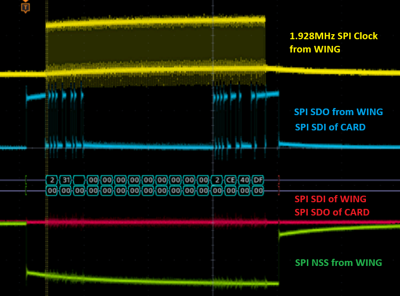
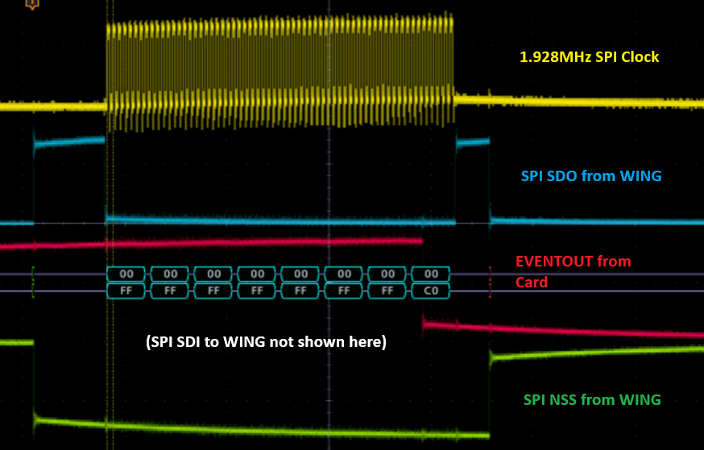
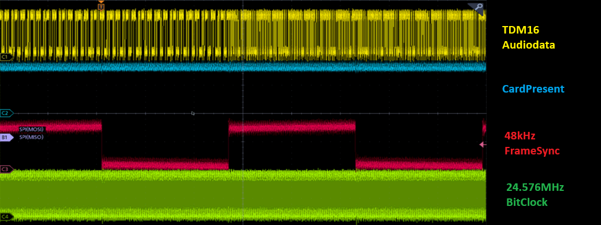
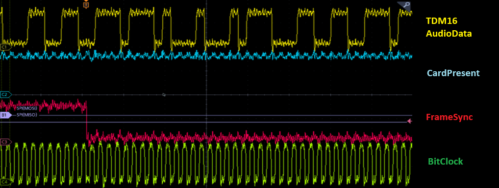

# WingCard - A DIY Expansion-Card for the Behringer WING

This repository is a work-in-progress project to create a DIY Expansion-Card for the Behringer WING Audio-Mixing-Console.

One possible plan is to use the XFBAPE DIY Card for the Behringer X32 to create a similar Expansion-Card, but with 64 channels instead of 32 channels.

With the current state of this project it is not possible to create a working device, but you are warmly invited to take part in the project here.

## Main-Information about connections (in comparison to X32)
[x] Different from the X32 the WING a SPI connection is used between STM32-controller and the Console
[x] Audio-connection is changed from a TDM8 to a TDM16 connection, with a bitclock of 24.576 MHz
[x] 64 channels with 24 bit and 48kHz (or 44.1kHz)
[x] Same PCB-connector made by JAE

## SPI Protocol Information
The WING uses a SPI connection for a bidirectional communication between WING and CARD. The communication uses (most of the time) a 64-bit-wide (16 byte) command with a 1.928MHz clock:

The used communication-protocol is leaned on the UART-protocol used in the Behringer X32: a start (ASCII-code 0x2a) starts a command followed by an ASCII char and one or more additional characters. The command is closed by another star (ASCII 0x2a) and a non-ASCII-value - probably a checksum-like 8-bit-value. Each command seems to be closed by a minimum of two 0x00. If the 64-bit is ending with only a single 0x00, a full 64-bit-word consisting only of 0x00 ends the communication.

As the CARD should be able to initiate communications, in addition to the common SPI-connections SCK, SDO, SDI and NSS an EVENTOUT of the CARD is used to tell the WING that the CARD has new information.

When CARD wants to send data to WING, it rises EVENTOUT on Pin 39 to high.
Then WING will set SPI NSS to GND and regular SPI-communication is done.
EVENTOUT is set to GND during the last byte of the communication!

Some of the recorded 64-bit words and parts of the protocol are documented in the file [a relative link](SPI-Protocol.md)

## Audio connection
The WING uses a comparable communication to the X32. But as the card supports 64 instead of 32 channels, TDM16 is used:

So the BitBlock uses 24.576 MHz instead of the 12.288 MHz of the X32:

Four TDM16-lines are connected to each of two XMOS-controllers to feed 32 channels to each SD-Card and receive the same number back to the WING.

## Card-connector
| Row A | Row B | Row C | Row D |
|  --------  |  -------  | -------  | -------  |
| 1 GND | 2 GND | 21 GND | 22 GND |
| 3 GND | 4 GND | 23 TDM16 WING Ch 1-16 | 24 3V3 CardPresent |
| 5 n/c | 6 n/c | 25 TDM16 WING Ch 17-32 | 26 n/c |
| 7 n/c | 8 n/c | 27 TDM16 WING Ch 33-48 | 28 n/c |
| 9 n/c | 10 GND | 29 TDM16 WING Ch 49-64 | 30 TDM BitClock (from WING) |
| 11 n/c | 12 GND | 31 TDM 16 SDCARD #2 | 32 TDM FrameSync (from WING) |
| 13 +5V | 14 +5V | 33 TDM 16 SDCARD #2 | 34 SPI SCK (from WING) |
| 15 +5V | 16 +5V | 35 TDM 16 SDCARD #1 | 36 SPI SDO (WING) |
| 17 GND | 18 GND | 37 TDM 16 SDCARD #1 | 38 SPI SDI (WING) |
| 19 GND | 20 GND | 39 CARD EVENTOUT | 40 SPI NSS |
